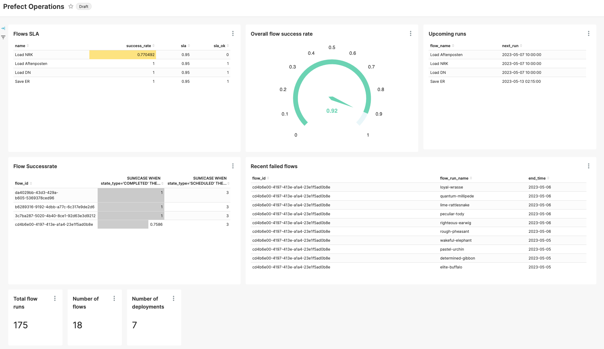

# Prefect operations dashboard

This project creates some dashboard-like tables for us to monitor how prefect is going. For operations, of course, the prefect portal is the place to go, but this is a way to democratize the run status.

The source tables are the tables loaded by the https://github.com/radbrt/tap-prefect meltano/singer Prefect tap.

Some information we might want to display:
- What flows exist, and when will they run next time.
- Failure rate for flows, making SLAs meaningful.
- Recovery times: How long time passes between a failed flow and the next successful one?
- What are the recently failed flows?

# What does this look like?
An example of a very crude dashboard in superset.

